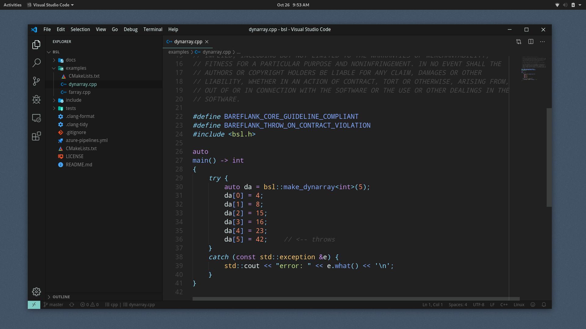

# **Bareflank Support Library**

[](https://dev.azure.com/bareflank/bsl/_build/latest?definitionId=2&branchName=master)
[](https://www.codefactor.io/repository/github/bareflank/bsl)
[](https://app.slack.com/client/TPN7LQKRP/CPJLF1RV1)

[](https://www.codacy.com/manual/rianquinn/bsl?utm_source=github.com&amp;utm_medium=referral&amp;utm_content=Bareflank/bsl&amp;utm_campaign=Badge_Grade)
[](https://www.codefactor.io/repository/github/bareflank/bsl)

## **A different view on Core Guideline Compliance**
The Bareflank Support Library (BSL) is a simple, header-only library that provides support for C++ Core Guideline Compliance. Similar to the goals of the Guideline Support Library (GSL) by Microsoft, the BSL aims to provide the facilities needed to ensure guideline compliance, while minimizing the need for verbosity.

<br>

[](images/example.png)

## **Quick start**
Get the latest version of the BSL from GitHub:

``` bash
git clone https://github.com/bareflank/bsl
```

Enjoy:

``` c++
#include "path/bsl.h"

auto
main() -> int
{
    auto da = bsl::make_dynarray<int>(42);
}
```

## **Documentation**

For detailed instructions, visit <https://bareflank.github.io/bsl/>
